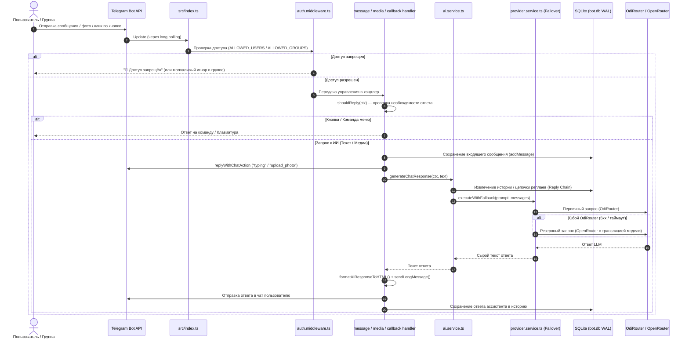

# 🤖 Universal AI Telegram Bot

Универсальный, масштабируемый Telegram-бот на базе **TypeScript** и фреймворка **grammY** с поддержкой множества текстовых нейросетей, компьютерного зрения, распознавания речи, генерации изображений, двух провайдеров с автоматическим переключением (failover) и интеллектуальным разделением контекста для личных и групповых чатов.

---

## 📑 Содержание

1. [О проекте и ключевые возможности](#-о-проекте-и-ключевые-возможности)
2. [Архитектура и структура проекта](#-архитектура-и-структура-проекта)
3. [Как взаимодействуют компоненты](#-как-взаимодействуют-компоненты)
4. [Организация запросов и ответов бота](#-организация-запросов-и-ответов-бота)
   - [Жизненный цикл сообщения](#жизненный-цикл-сообщения)
   - [Форматирование в HTML и защита от падений](#форматирование-в-html-и-защита-от-падений)
   - [Разбивка длинных сообщений (Chunking)](#разбивка-длинных-сообщений-chunking)
   - [Обход лимита 64 байт в Telegram Callback Data](#обход-лимита-64-байт-в-telegram-callback-data)
   - [Двухуровневый Failover провайдеров ИИ](#двухуровневый-failover-провайдеров-ии)
5. [Поведение бота: Личный чат vs Общая беседа](#-поведение-бота-личный-чат-vs-общая-беседа)
   - [Работа в личном чате (Private Chat)](#1-работа-в-личном-чате-private-chat)
   - [Работа в группе / супергруппе (Group Chat & Forums)](#2-работа-в-группе--супергруппе-group-chat--forums)
   - [Сравнительная таблица режимов](#сравнительная-таблица-режимов)
6. [База данных и схема хранения](#-база-данных-и-схема-хранения)
7. [Каталог поддерживаемых моделей](#-каталог-поддерживаемых-моделей)
8. [Команды и управление](#-команды-и-управление)
9. [Установка, настройка и запуск](#-установка-настройка-и-запуск)
   - [Переменные окружения (.env)](#переменные-окружения-env)
   - [Запуск проекта](#запуск-проекта)
   - [Health-Check сервер](#health-check-сервер)

---

## 🌟 О проекте и ключевые возможности

**Universal AI Bot** — это персональный и групповой ассистент, объединяющий современные возможности генеративного искусственного интеллекта:

* 💬 **Умный диалог с памятью**: бот помнит предысторию беседы, понимает имена собеседников и сохраняет логику диалога.
* 🔀 **Два провайдера с авто-переключением (Failover)**: основной провайдер **OdiRouter** с мгновенным автоматическим переключением на **OpenRouter** при сетевых сбоях или недоступности API.
* 🖼️ **Компьютерное зрение (Vision)**:
  * Анализ изображений и ответы на вопросы («Что на фото?»).
  * Режим улучшения фото («Улучши» / «Фотореализм»): детальное описание композиции и создание новой версии через диффузионную модель.
* 🎨 **Генерация картинок по тексту**: команда `/imagine [промпт]` (модели Flux Pro 1.1 и Gemini Image) с авто-отправкой результата в чат.
* 🎤 **Распознавание речи (STT / Voice)**: бот принимает голосовые сообщения в формате `.ogg`, транскрибирует их в текст (Whisper-1 / Minimax) и сразу отвечает на запрос.
* 🤖 **Свободный выбор моделей**: переключение между бесплатными моделями (Google Gemini, OpenAI GPT, Anthropic Claude, Qwen, Grok) и флагманскими платными моделями.
* 🛡️ **Контроль доступа (Whitelist)**: гибкие списки разрешённых пользователей (`ALLOWED_USERS`) и разрешённых групп (`ALLOWED_GROUPS`).
* 🧵 **Поддержка топиков Telegram (Forum Threads)**: независимая память в каждом топике супергруппы.
* 🏥 **Express Health-Check**: встроенный легковесный HTTP-сервер для мониторинга (Uptime Kuma, Render, Railway, VPS).

---

## 📂 Архитектура и структура проекта

Проект спроектирован по модульному принципу с четким разделением ответственности (SoC — Separation of Concerns):

```text
universal-ai-bot/
├── bot.db                   # База данных SQLite (создается автоматически)
├── package.json             # Зависимости и npm-скрипты
├── tsconfig.json            # Конфигурация TypeScript (ESNext, NodeNext)
├── .env                     # Секретные ключи и переменные окружения
├── .gitignore               # Исключения версионирования git
└── src/
    ├── index.ts             # Точка входа: инициализация Bot, Express, graceful shutdown
    ├── db.ts                # Реэкспорт интерфейсов базы данных
    ├── models.json          # Каталог доступных платных и бесплатных моделей
    ├── config/
    │   └── index.ts         # Загрузка .env, маппинг алиасов моделей, системный промпт
    ├── db/
    │   └── index.ts         # Инициализация better-sqlite3, WAL-режим, миграции, DAO
    ├── handlers/
    │   ├── callback.handler.ts # Обработка нажатий Inline-кнопок (пагинация, выбор модели)
    │   ├── command.handler.ts  # Обработка команд (/start, /help, /clear, /model и др.)
    │   ├── media.handler.ts    # Обработка фото и голосовых сообщений
    │   └── message.handler.ts  # Роутинг текстовых сообщений, кнопок меню, фильтрация shouldReply
    ├── keyboards/
    │   ├── main.ts          # Главная Reply-клавиатура быстрого доступа
    │   └── models.ts        # Динамическая Inline-клавиатура выбора моделей с пагинацией
    ├── middlewares/
    │   └── auth.middleware.ts # Проверка прав доступа по белым спискам пользователей и групп
    ├── services/
    │   ├── ai.service.ts       # Сборка контекста диалога (Personal vs Group) и вызов LLM
    │   ├── image.service.ts    # Генерация изображений и отправка их в Telegram
    │   ├── provider.service.ts # Клиенты OpenAI, маршрутизация OdiRouter/OpenRouter, failover
    │   ├── vision.service.ts   # Анализ и улучшение фото (мультимодальные запросы)
    │   └── whisper.service.ts  # Распознавание аудиозаписей в текст
    └── utils/
        ├── html.ts          # Санитизация текста и форматирование кода в безопасный HTML
        └── text.ts          # Чанкование длинных сообщений (обход лимита 4096 символов)
```

---

## 🔄 Как взаимодействуют компоненты

Ниже представлена диаграмма прохождения входящего события через систему:



---

## ⚙️ Организация запросов и ответов бота

### Жизненный цикл сообщения

1. **Приём события**: В `src/index.ts` зарегистрированы глобальный перехватчик ошибок `bot.catch` и слушатели `message:text`, `message:photo`, `message:voice`, `callback_query:data`.
2. **Фильтрация вызова (`shouldReply`)**: Бот определяет тип чата (`private` или `group`/`supergroup`) и решает, адресовано ли сообщение ему (см. раздел [Поведение бота](#-поведение-бота-личный-чат-vs-общая-беседа)).
3. **Сохранение в базу данных**: Сообщение фиксируется в таблице `messages` с полями `chat_id`, `msg_id`, `role`, `content`, `user_name` и таймстемпом.
4. **Визуальная индикация**: Пользователь сразу видит статус «печатает...» (`typing`) или «загрузка фото...» (`upload_photo`), что обеспечивает отзывчивый UX при длительной генерации.
5. **Сборка промпта**: В `src/services/ai.service.ts` подтягивается системный промпт, имя текущего пользователя и история (линейная или древовидная).
6. **Вызов ИИ с защитой**: Запрос направляется через `executeWithFallback` в `provider.service.ts`.
7. **Форматирование и доставка**: Ответ валидируется, экранируется для Telegram HTML и отправляется чанками.

---

### Форматирование в HTML и защита от падений

В Telegram разметка `parse_mode: 'HTML'` чувствительна к спецсимволам: незакрытый тег или случайно сгенерированные символы `<`, `>`, `&` приводят к ошибке Telegram API `400 Bad Request: can't parse entities`.

Для решения этой проблемы в `src/utils/html.ts`:
1. Регулярными выражениями извлекаются блоки кода ```код``` и инлайн-код \`код\`.
2. Их содержимое безопасно оборачивается в `<pre><code>...</code></pre>` и `<code>...</code>` с внутренним экранированием спецсимволов.
3. Оставшийся свободный текст экранируется функциями `& -> &amp;`, `< -> &lt;`, `> -> &gt;`.
4. Блоки кода возвращаются на свои места.
5. Если Telegram всё равно отвергает распарсенный фрагмент, `sendLongMessage` ловит исключение и отправляет чанк чистым текстом, гарантируя, что пользователь не останется без ответа.

---

### Разбивка длинных сообщений (Chunking)

Лимит Telegram на одно сообщение составляет **4096 символов**.
В утилите `src/utils/text.ts` реализована функция `sendLongMessage`:
* Установлен безопасный лимит части — **3900 символов** (запас под обрамляющие HTML-теги).
* Текст разбивается по границам строк `\n`, сохраняя целостность абзацев и списков.
* Если отдельная строка превышает лимит, она нарезается посимвольно.
* Между отправками чанков выдерживается пауза в **300 мс**, предотвращающая попадание под Telegram Rate Limit (`429 Too Many Requests`).

---

### Обход лимита 64 байт в Telegram Callback Data

Telegram имеет жесткое ограничение: поле `callback_data` у кнопок `InlineKeyboardButton` не может превышать **64 байта**.

Идентификаторы современных моделей ИИ часто имеют вид:
`deepseek/deepseek-chat`, `free-gemini-3.1-pro-preview`, `google/gemini-3.1-flash-lite-image`. Если добавить к ним префикс команды (например `setmodel_free-gemini-3.1-pro-preview`), размер превышает 64 байта, вызывая фатальную ошибку API.

**Решение в проекте (`src/config/index.ts`):**
При запуске генерируется двусторонняя таблица коротких псевдонимов (алиасов):
* Для платных моделей: `p_auto`, `p_luna`, `p_smart`, `p_code` и т.д.
* Для бесплатных моделей: `f_0`, `f_1`, `f_2` ... `f_9`.

При формировании кнопок в `callback_data` передается только `setmodel_f_3`, что занимает не более 15 байт. В `callback.handler.ts` алиас мгновенно восстанавливается обратно в полный идентификатор модели через `getModelByAlias(alias)`.

---

### Двухуровневый Failover провайдеров ИИ

В сервисе `src/services/provider.service.ts` реализована функция `executeWithFallback`:
* Основной провайдер берется из переменной `AI_PROVIDER` (по умолчанию `odirouter`).
* Если `odirouter` возвращает ошибку (таймаут, падение шлюза, лимит квоты), бот ловит ошибку в блоке `catch`, логирует предупреждение в консоль и без задержки повторяет тот же запрос через резервный клиент **OpenRouter**.
* Функция `mapModelForProvider` автоматически транслирует внутренние ID моделей OdiRouter в валидные идентификаторы OpenRouter:
  * `free-gpt-5.4-mini` ➔ `openai/gpt-4o-mini`
  * `free-gemini-3.5-flash` ➔ `google/gemma-3-12b-it`
  * `deepseek-v4-pro` ➔ `deepseek/deepseek-chat`
  * `claude-opus-4-8` ➔ `anthropic/claude-3.5-sonnet`
* Для пользователя переключение происходит совершенно незаметно.

---

## 👥 Поведение бота: Личный чат vs Общая беседа

Бот кардинально по-разному организует контекст и логику реагирования в зависимости от типа чата. Это исключает путаницу в беседах с большим количеством участников.

### 1. Работа в личном чате (Private Chat)

В приватном диалоге пользователь общается с ботом один на один:

* **100% отзывчивость**: Функция `shouldReply` возвращает `true` для любого входящего текстового сообщения, голосовой заметки или фотографии. Бота не нужно тегать.
* **Линейная история (Linear History)**:
  * Из SQLite извлекаются последние 10 сообщений диалога (`role: user` и `role: assistant`).
  * Все сообщения передаются в модель по порядку, обеспечивая непрерывность мысли и долговременную память.
* **Персонализированный промпт**:
  * В системный промпт добавляется строка: `Собеседник: ${senderName}.` Бот обращается к пользователю по имени.
* **Постоянная клавиатура**:
  * Пользователю доступна нижняя Reply-клавиатура с кнопками быстрого доступа: `💬 Чат`, `🖼 Фото`, `🎨 Imagine`, `🎤 Голос`, `🤖 Модель`, `🗑 Очистить`, `ℹ️ Помощь`.
* **Авторизация**:
  * Если задана переменная `ALLOWED_USERS`, бот проверяет `ctx.from.id`. При отсутствии ID в списке бот отвечает `🚫 Доступ запрещён.`

---

### 2. Работа в группе / супергруппе (Group Chat & Forums)

В групповых чатах общение нескольких человек создает непрерывный поток сообщений. Классические боты в таких условиях путают контексты разных тем или спамят на каждую реплику. В данном проекте реализовано специальное трёхуровневое решение:

#### А. Фильтрация входящих сообщений (`shouldReply`)
Бот **полностью игнорирует** общую переписку участников и вступает в диалог **только** в трех случаях:
1. Сообщение начинается со знака `/` (команды: `/imagine`, `/help`, `/model`, `/clear` и т.д.). Команды с суффиксом бота вроде `/imagine@my_bot` корректно очищаются функцией `extractCommand`.
2. В тексте сообщения содержится прямое упоминание юзернейма бота (например `@parf_universal_ai_bot`).
3. Сообщение отправлено в режиме **Reply (ответ)** на любое предыдущее сообщение бота (`reply_to_message.from.is_bot === true`).

#### Б. Изоляция контекста топиков форумов (Forum Threads)
* Telegram поддерживает группы с темами (супергруппы-форумы).
* Функция `getThreadId(ctx)` проверяет параметр `message_thread_id`.
* Идентификатор контекста в базе формируется как `${chatId}_${message_thread_id}`.
* **Результат**: диалог в топике «Разработка» никак не пересекается и не засоряет историю топика «Маркетинг» или генерального чата.

#### В. Умная работа с контекстом: Режим без Reply vs Reply Chain
В групповом чате системный промпт автоматически модифицируется:
> *«Ты в групповом чате Telegram. Твоим ТЕКУЩИМ собеседником является ТОЛЬКО [Имя]. Если в истории присутствуют сообщения других пользователей (в формате [Имя]), используй их ИСКЛЮЧИТЕЛЬНО как фоновый контекст для понимания вопроса. НЕ отвечай авторам предыдущих сообщений и НЕ обращаясь к ним. Отвечай СТРОГО пользователю [Имя]!»*

Далее логика разделяется на два варианта:

1. **Запрос БЕЗ Reply (например: `@bot какая погода в Риме?`)**:
   * Бот **не подмешивает** старые случайные сообщения из базы данных.
   * Формируется изолированный запрос, состоящий только из системного промпта и текущего вопроса:
     `[Имя]: какая погода в Риме?`
   * Это предотвращает эффект «галлюцинаций контекста», когда бот пытается связать случайный вопрос с чужим разговором получасовой давности.

2. **Запрос С Reply (Reply Chain — ответ на сообщение)**:
   * Если пользователь отвечает реплаем на реплику бота или другого участника, алгоритм разворачивает точечную цепочку цитирования **до 5 уровней в глубину**.
   * Алгоритм переходит по ссылкам `reply_to_message`, сверяет `message_id` с таблицей сообщений в SQLite (`getMessageByMsgId`) и определяет точного автора каждой реплики:
     * Если реплика принадлежит боту ➔ роль `assistant`.
     * Если реплика принадлежит пользователю ➔ роль `user` с тегом автора: `[Иван]: текст сообщения`.
   * Собирается четкая цепочка именно этой ветки разговора, и бот отвечает точно в контексте обсуждаемого вопроса.

#### Г. Авторизация групп
* Если в конфигурации задана переменная `ALLOWED_GROUPS`, бот проверяет ID группы.
* Если группа не входит в список разрешенных, бот **молча завершает обработку**, не засоряя чат сообщениями об ошибках.

---

### Сравнительная таблица режимов

| Параметр | Личный чат (Private) | Группа / Супергруппа (Group) |
| :--- | :--- | :--- |
| **Реакция на текст** | На любое входящее сообщение | Только команды, `@mention` или `Reply` боту |
| **История контекста** | Последние 10 сообщений диалога подряд | Режим цепочки цитирования (Reply Chain до 5 уровней) или только текущий вопрос |
| **Тегирование авторов** | Единый собеседник | Префикс каждого автора в формате `[Имя]` |
| **Изоляция топиков** | Один поток на чат | Отдельный контекст на каждый `thread_id` форума |
| **Нижнее меню кнопок** | Активно и постоянно доступно | Скрыто, управление через слеш-команды |
| **Реакция на отказ доступа** | Сообщение: `🚫 Доступ запрещён.` | Молчаливый выход из обработки |

---

## 🗄️ База данных и схема хранения

Для персистентного хранения данных используется высокопроизводительный движок **SQLite** через библиотеку `better-sqlite3`.

При запуске автоматически включается режим опережающей записи логов (WAL):
```sql
PRAGMA journal_mode = WAL;
```
Это обеспечивает возможность параллельного чтения без блокировки транзакций записи.

### Таблицы базы данных

#### 1. Таблица `chats`
Хранит информацию об известных боту чатах.
```sql
CREATE TABLE IF NOT EXISTS chats (
  id TEXT PRIMARY KEY,               -- ID чата (или threadId для топиков)
  type TEXT,                         -- private, group, supergroup
  title TEXT,                        -- Название группы или имя пользователя
  created_at DATETIME DEFAULT CURRENT_TIMESTAMP
);
```

#### 2. Таблица `messages`
Хранит историю сообщений для формирования контекста и резолвинга цепочек ответов (Reply Chain).
```sql
CREATE TABLE IF NOT EXISTS messages (
  id INTEGER PRIMARY KEY AUTOINCREMENT,
  chat_id TEXT NOT NULL,             -- Идентификатор чата или топика
  msg_id INTEGER,                    -- Telegram message_id для связывания reply
  role TEXT NOT NULL,                -- 'user' | 'assistant' | 'system'
  content TEXT NOT NULL,             -- Текст сообщения
  user_name TEXT,                    -- Имя отправителя
  created_at DATETIME DEFAULT CURRENT_TIMESTAMP
);

CREATE INDEX IF NOT EXISTS idx_messages_chat_msg ON messages(chat_id, msg_id);
CREATE INDEX IF NOT EXISTS idx_messages_chat_created ON messages(chat_id, created_at);
```

#### 3. Таблица `user_settings`
Хранит персональные настройки пользователей и групп (выбранную активную модель ИИ).
```sql
CREATE TABLE IF NOT EXISTS user_settings (
  chat_id TEXT PRIMARY KEY,          -- Идентификатор чата
  model TEXT DEFAULT 'openrouter/auto', -- Выбранная модель
  updated_at DATETIME DEFAULT CURRENT_TIMESTAMP
);
```

---

## 🧠 Каталог поддерживаемых моделей

Конфигурация моделей вынесена в JSON-файл [`src/models.json`](file:///Users/parfenovgregory/Documents/разработки%20прог/universal-ai-bot/src/models.json):

### Платные модели (`paid`)
Быстрый выбор через команды `/<ключ>`:

| Команда | Название модели | Системный ID | Особенности / Цена |
| :--- | :--- | :--- | :--- |
| `/auto` | Авто (Бесплатная GPT 5.4) | `free-gpt-5.4-mini` | Универсальная, бесплатно |
| `/luna` | GPT 5.6 Luna | `gpt-5.6-luna` | Быстрая, $0.002 / 1M токенов |
| `/ultra`| GPT 5.6 Terra | `gpt-5.6-terra` | Экономичная, $0.02 / 1M токенов |
| `/cheap`| Qwen 3.6 Flash | `qwen3.6-flash` | Базовая, $0.005 / 1M токенов |
| `/qwen3`| Qwen 3.8 Max | `qwen3.8-max-preview` | Аналитическая, $0.05 / 1M токенов |
| `/fast` | Gemini 3.6 Flash | `gemini-3.6-flash` | Высокая скорость, $0.075 / 1M токенов |
| `/smart`| GPT 5.5 | `gpt-5.5` | Сложные рассуждения, $0.049 / 1M токенов |
| `/code` | DeepSeek V4 Pro | `deepseek-v4-pro` | Для программирования, $0.01 / 1M токенов |
| `/creative` | Claude Opus 4.8 | `claude-opus-4-8` | Творческие задачи, $0.125 / 1M токенов |
| `/opus5`| Claude Opus 5 | `claude-opus-5` | Флагман рассуждений, $0.15 / 1M токенов |

### Бесплатные модели (`free`)
Доступны через меню `/freemodels` с инлайн-пагинацией (по 5 моделей на страницу):
* `Google Gemini 3.5 Flash` (`free-gemini-3.5-flash`)
* `OpenAI GPT 5.4 Mini` (`free-gpt-5.4-mini`)
* `Anthropic Claude Haiku 4.5` (`free-claude-haiku-4.5`)
* `Qwen 3.6 Flash` (`free-qwen3.6-flash`)
* `xAI Grok 4.5` (`free-grok-4.5`)
* `Google Gemini 3.1 Pro Preview` (`free-gemini-3.1-pro-preview`)
* `Qwen 3.7 Plus` (`free-qwen3.7-plus`)
* `OpenAI GPT 5.6 Luna` (`free-gpt-5.6-luna`)
* `MiniMax M2.7` (`free-minimax-m2.7`)
* `Google Gemini 2.5 Pro` (`free-gemini-2.5-pro`)

---

## 🕹️ Команды и управление

### Текстовые команды
* `/start` или `/menu` — Приветственное сообщение и открытие главного кнопочного меню.
* `/help` — Подробный справочник по возможностям бота.
* `/model` — Список доступных моделей с тарифами и быстрым выбором.
* `/freemodels` — Открыть интерактивное меню выбора бесплатных нейросетей.
* `/current` — Показать название текущей активной модели чата.
* `/price` — Таблица расценок за токены и генерацию картинок.
* `/clear` — Очистить сохраненную историю контекста в текущем чате или топике.
* `/history` — Показать последние 5 сообщений из базы данных.
* `/imagine <описание>` — Сгенерировать арт по текстовому запросу.
* `/setmodel <model_id>` — Установить произвольный ID модели вручную.

### Мультимедийные действия
* **Фотография с подписью «Что на фото?»**: Вызов мультимодального анализа через `vision.service.ts`.
* **Фотография с подписью «Улучши» или «Фотореализм»**: Анализ исходного фото, формирование детализированного промпта и повторная генерация улучшенной версии через модель диффузии.
* **Голосовое сообщение (Voice)**: Аудио скачивается, конвертируется и распознается через Whisper API, транскрипт выводится пользователю, после чего бот отвечает на озвученный вопрос.

---

## 🚀 Установка, настройка и запуск

### Требования
* **Node.js** версии 20.x или выше (рекомендуется Node 22+).
* Менеджер пакетов **npm**.

### Переменные окружения (.env)

Создайте файл `.env` в корневой директории проекта со следующим содержимым:

```env
# Токен бота, полученный у @BotFather
TELEGRAM_BOT_TOKEN=1234567890:ABCdefGHIjklMNOpqrsTUVwxyz

# API ключ OdiRouter (основной провайдер)
ODIROUTER_API_KEY=sk-...

# API ключ OpenRouter (резервный провайдер)
OPENROUTER_API_KEY=sk-or-v1-...

# Активный провайдер по умолчанию (odirouter или openrouter)
AI_PROVIDER=odirouter

# Модель по умолчанию
MODEL=free-gpt-5.4-mini

# Порт встроенного Express health-check сервера
PORT=3000

# Белый список пользователей (через запятую). Оставьте пустым для общего доступа.
ALLOWED_USERS=123456789,987654321

# Белый список групп (через запятую). Оставьте пустым для всех групп.
ALLOWED_GROUPS=-1001234567890
```

---

### Запуск проекта

1. **Клонирование репозитория и установка зависимостей**:
   ```bash
   git clone <URL_РЕПОЗИТОРИЯ>
   cd universal-ai-bot
   npm install
   ```

2. **Запуск в режиме разработки (с автоперезагрузкой при изменении кода)**:
   ```bash
   npm run dev
   ```

3. **Сборка TypeScript в JavaScript**:
   ```bash
   npm run build
   ```

4. **Запуск собранной версии в продакшене**:
   ```bash
   npm start
   ```

---

### Health-Check сервер

При старте бота поднимается встроенный HTTP-сервер Express на порту `PORT` (по умолчанию `3000`):

* `GET /` — Базовый статус сервиса и uptime:
  ```json
  { "status": "ok", "uptime": 42.15 }
  ```
* `GET /health` — Эндпоинт для мониторинга доступности:
  ```json
  { "status": "healthy", "timestamp": "2026-10-06T10:37:25.000Z" }
  ```

Сервер позволяет привязать внешние сервисы мониторинга (UptimeRobot, BetterStack, Render Health Checks), предотвращая засыпание контейнеров и сигнализируя о сбоях.

При получении сигналов завершения процесса (`SIGINT`, `SIGTERM`) срабатывает корректный **Graceful Shutdown**:
* Останавливается long polling бота grammY (`bot.stop()`).
* Закрывается Express сервер (`server.close()`).
* Сбрасываются дескрипторы базы данных SQLite WAL.
